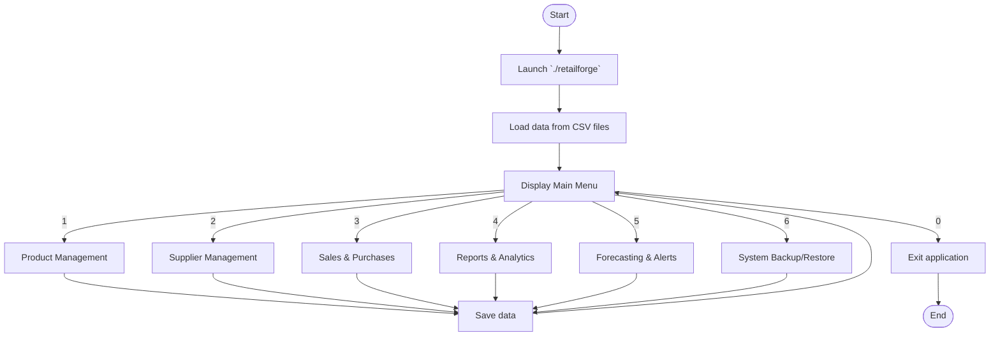

# RetailForge Flow Chart

This flowchart shows the main application flow for RetailForge, focusing on the top-level menu and modules.

## Notes
- The chart is intentionally high-level and shows only the main menu and primary modules.
- Control returns to the main menu after each module completes.
