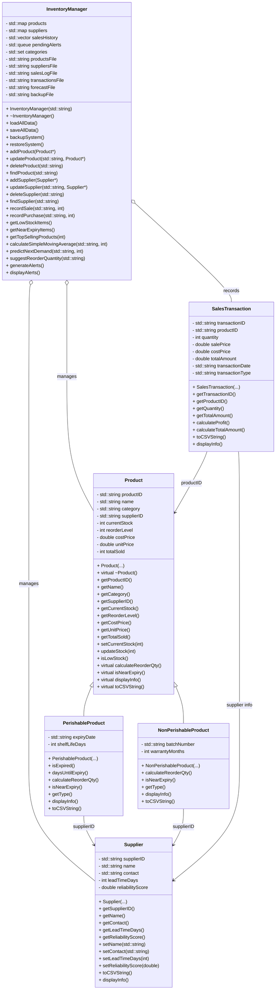

# RetailForge UML Diagram

This diagram captures the main classes and relationships in the RetailForge inventory management system.

```mermaid
classDiagram
    class Product {
        - std::string productID
        - std::string name
        - std::string category
        - std::string supplierID
        - int currentStock
        - int reorderLevel
        - double costPrice
        - double unitPrice
        - int totalSold
        + Product(...)
        + virtual ~Product()
        + getProductID()
        + getName()
        + getCategory()
        + getSupplierID()
        + getCurrentStock()
        + getReorderLevel()
        + getCostPrice()
        + getUnitPrice()
        + getTotalSold()
        + setCurrentStock(int)
        + updateStock(int)
        + isLowStock()
        + virtual calculateReorderQty()
        + virtual isNearExpiry()
        + virtual displayInfo()
        + virtual toCSVString()
    }

    class PerishableProduct {
        - std::string expiryDate
        - int shelfLifeDays
        + PerishableProduct(...)
        + isExpired()
        + daysUntilExpiry()
        + calculateReorderQty()
        + isNearExpiry()
        + getType()
        + displayInfo()
        + toCSVString()
    }

    class NonPerishableProduct {
        - std::string batchNumber
        - int warrantyMonths
        + NonPerishableProduct(...)
        + calculateReorderQty()
        + isNearExpiry()
        + getType()
        + displayInfo()
        + toCSVString()
    }

    class Supplier {
        - std::string supplierID
        - std::string name
        - std::string contact
        - int leadTimeDays
        - double reliabilityScore
        + Supplier(...)
        + getSupplierID()
        + getName()
        + getContact()
        + getLeadTimeDays()
        + getReliabilityScore()
        + setName(std::string)
        + setContact(std::string)
        + setLeadTimeDays(int)
        + setReliabilityScore(double)
        + toCSVString()
        + displayInfo()
    }

    class SalesTransaction {
        - std::string transactionID
        - std::string productID
        - int quantity
        - double salePrice
        - double costPrice
        - double totalAmount
        - std::string transactionDate
        - std::string transactionType
        + SalesTransaction(...)
        + getTransactionID()
        + getProductID()
        + getQuantity()
        + getTotalAmount()
        + calculateProfit()
        + calculateTotalAmount()
        + toCSVString()
        + displayInfo()
    }

    class InventoryManager {
        - std::map<std::string, Product*> products
        - std::map<std::string, Supplier*> suppliers
        - std::vector<SalesTransaction> salesHistory
        - std::queue<std::string> pendingAlerts
        - std::set<std::string> categories
        - std::string productsFile
        - std::string suppliersFile
        - std::string salesLogFile
        - std::string transactionsFile
        - std::string forecastFile
        - std::string backupFile
        + InventoryManager(std::string)
        + ~InventoryManager()
        + loadAllData()
        + saveAllData()
        + backupSystem()
        + restoreSystem()
        + addProduct(Product*)
        + updateProduct(std::string, Product*)
        + deleteProduct(std::string)
        + findProduct(std::string)
        + addSupplier(Supplier*)
        + updateSupplier(std::string, Supplier*)
        + deleteSupplier(std::string)
        + findSupplier(std::string)
        + recordSale(std::string, int)
        + recordPurchase(std::string, int)
        + getLowStockItems()
        + getNearExpiryItems()
        + getTopSellingProducts(int)
        + calculateSimpleMovingAverage(std::string, int)
        + predictNextDemand(std::string, int)
        + suggestReorderQuantity(std::string)
        + generateAlerts()
        + displayAlerts()
    }

    Product <|-- PerishableProduct
    Product <|-- NonPerishableProduct
    InventoryManager o-- Product : manages
    InventoryManager o-- Supplier : manages
    InventoryManager o-- SalesTransaction : records
    PerishableProduct --> Supplier : supplierID
    NonPerishableProduct --> Supplier : supplierID
    SalesTransaction --> Product : productID
    SalesTransaction --> Supplier : supplier info
```
